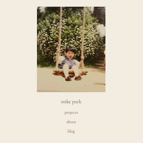

# Mike Park Personal Site



[](https://opensource.org/licenses/MIT)

Production deploy @ [www.mike-park.com](mike-park.com)

A website built with NextJS and React.

[Sketches](https://drive.google.com/drive/folders/1AS-DVTbEN7xme3h_qWRyDPyIrOS53zQf?usp=drive_link)

## Getting Started

To run the development server:

```bash
npm run dev
```

Open [http://localhost:3000](http://localhost:3000) with your browser to see the result.

## Feedback

Feel free to reach out to me here on Github or at contactmikepark@gmail.com.
